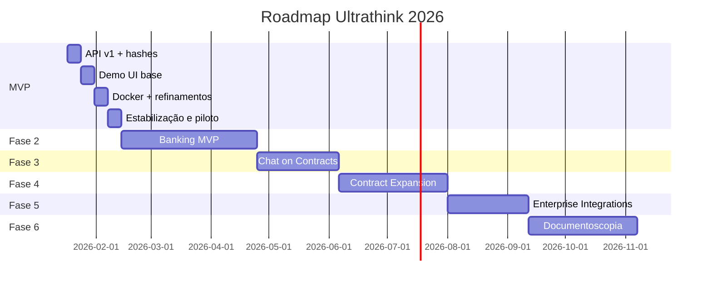

# Ultrathink — Roadmap 2026

**Versão:** 1.0  
**Data:** Janeiro 2026  
**MVP testável em:** 13 de fevereiro de 2026  
**Referência “hoje”:** 17 de janeiro de 2026

---

## 1. Tecnologias e Serviços

### 1.1 Backend

| Tecnologia | Versão | Uso | Fase |
|------------|--------|-----|------|
| Python | 3.12 | Runtime, tipagem | 1 |
| FastAPI | 0.115+ | API REST, OpenAPI, validação | 1 |
| Uvicorn | 0.30+ | Servidor ASGI | 1 |
| uv | — | Dependências, lockfile, venv | 1 |
| pyproject.toml | — | Metadados, deps, scripts | 1 |
| pydantic | — | Schemas, validação | 1 |
| pydantic-settings | — | Config (env, feature flags) | 1 |
| python-multipart | — | Upload de arquivos | 1 |
| httpx | — | Cliente HTTP (webhooks) | 2 |
| hashlib | stdlib | SHA-256 (document_hash, result_hash) | 1 |

### 1.2 OCR e ML

| Tecnologia | Versão / Referência | Uso | Fase |
|------------|---------------------|-----|------|
| PyMuPDF (fitz) | pymupdf | PDF → imagem por página | 1 |
| OpenCV | opencv-python | Manipulação de imagem (BGR) | 1 |
| PaddleOCR | 3.3+ | OCR impresso, `lang="pt"` | 1 |
| PaddlePaddle | 3.2+ | Backend do PaddleOCR | 1 |
| TrOCR | Hugging Face `microsoft/trocr-base-handwritten` | Refinamento manuscrito | 1 (opcional) ou 2 |
| transformers | — | Carregar TrOCR | 1 (opcional) |
| torch | — | Backend TrOCR | 1 (opcional) |
| paddlepaddle-gpu, CUDA | — | GPU para batch/TrOCR-large | 2+ |

### 1.3 Frontend

| Tecnologia | Versão | Uso | Fase |
|------------|--------|-----|------|
| Bun | 1.1+ | Runtime, package manager, scripts | 1 |
| Next.js | 15 | Framework, App Router, build, roteamento | 1 |
| React | 18 | UI, componentes (incluído no Next) | 1 |
| TypeScript | 5 | Tipagem, contratos API | 1 |
| lucide-react | — | Ícones | 1 |
| fetch / ky | — | Chamadas `POST /v1/extract` | 1 |
| Vitest ou Jest | — | Testes unit e componente | 1 |
| @testing-library/react | — | Testes de componentes | 1 |
| Playwright | — | E2E (opcional) | 1 (pós-MVP) ou 2 |
| ESLint, eslint-config-next | — | Lint | 1 |
| Prettier | — | Formatação | 1 |

### 1.4 Infraestrutura e Deploy

| Tecnologia / Serviço | Uso | Fase |
|----------------------|-----|------|
| Docker | Imagens multi-stage (frontend + API) | 1 |
| docker-compose | Orquestração API + estático | 1 |
| .dockerignore | Excluir node_modules, __pycache__, .git | 1 |
| nginx ou Caddy | Reverse proxy, TLS, rate limiting | 2 |
| Uvicorn workers | 2–4 em produção | 2 |
| Kubernetes, ECS | Deploy cloud (futuro) | 5 |
| Modal, RunPod | GPU serverless (futuro) | 2+ |

### 1.5 Persistência

| Tecnologia | Uso | Fase |
|------------|-----|------|
| Nenhum (memória) | Documentos e resultado não persistidos no servidor | 1 |
| Arquivo ou SQLite | Log de auditoria (apenas hashes, sem PII) — opcional | 1 |
| SQLite ou Postgres | Audit trail (hashes, logs, `document_type`, etc.) | 2 |
| BigQuery ou similar | Billing, métricas agregadas | 2+ |
| SQLite local (cliente) | documents, chunks, chat_sessions, chat_messages | 3 |
| Qdrant | Vetores/embeddings no cliente (opcional) | 3 |

### 1.6 Segurança

| Tecnologia / Prática | Uso | Fase |
|----------------------|-----|------|
| hashlib (SHA-256) | document_hash, result_hash | 1 |
| TLS | 1.3 em produção (reverse proxy) | 2 |
| API Key | `Authorization: Bearer uk_xxx` ou `X-API-Key` | 2 |
| CORS | Restringir origens; localhost em dev | 1 |
| Variáveis de ambiente | Secrets, não commitar .env | 1 |
| Overwrite 3-pass | Deleção segura de arquivos temporários | 2 |

### 1.7 Observabilidade

| Tecnologia | Uso | Fase |
|------------|-----|------|
| GET /v1/health | status, motor (PaddleOCR ou PaddleOCR+TrOCR) | 1 |
| structlog ou logging | Logs estruturados (JSON) | 2 |
| Prometheus | prometheus-client, métricas (latency, requests, errors) | 2 |
| OpenTelemetry | Tracing (opcional) | 2+ |
| Fluentd, Loki, CloudWatch | Coleta de logs (a definir) | 2+ |

### 1.8 RAG e Embeddings (Fase 3)

| Tecnologia | Uso | Fase |
|------------|-----|------|
| text-embedding-3-small (OpenAI) ou similar | Embeddings para chunks | 3 |
| Chunks + embeddings | chat_package na API | 3 |
| SQLite ou Qdrant (cliente) | Armazenar vetores para RAG | 3 |

### 1.9 Ferramentas de Desenvolvimento

| Ferramenta | Uso | Fase |
|------------|-----|------|
| uv | deps, `uv run uvicorn`, `uv run pytest` | 1 |
| ruff | Lint e format (Python) | 1 |
| mypy | Checagem de tipos (opcional) | 1 |
| pre-commit | Hooks (ruff, mypy, etc.) | 1 |
| npm ou pnpm | Frontend: deps, build, dev | 1 |
| guarddog, safety | dependency-groups (semgrep) | 1 |

### 1.10 Design e Produto

| Ferramenta | Uso | Fase |
|------------|-----|------|
| Design System (tokens, Harvey-inspired) | docs/DESIGN_SYSTEM.md, tokens.css | 1 |
| Figma | Biblioteca de componentes (opcional) | 2+ |

### 1.11 Serviços Externos / Cloud

| Serviço | Uso | Fase |
|---------|-----|------|
| Nenhum obrigatório | Tudo local ou on-prem | 1 |
| Hugging Face | Modelos TrOCR | 1 (opcional) ou 2 |
| Hospedagem (VPS, AWS, GCP, etc.) | Deploy API e frontend | 2 |
| Domínio e TLS | Produção | 2 |
| OpenAI ou similar | API de embeddings | 3 |
| Modal, RunPod | GPU para OCR/ML (opcional) | 2+ |
| Prometheus, Loki, CloudWatch | Observabilidade | 2+ |

---

## 2. Roadmap 2026

### 2.1 Visão Geral

| Período | Marco | Entregas principais |
|---------|-------|----------------------|
| **17 jan – 13 fev** | **MVP testável** | API v1, hashes, demo UI, Docker; piloto preparado |
| **14 fev – abr** | Fase 2 | Banking (templates, batch, webhooks, zero-retention, certificado, admin) |
| **Mai – jun** | Fase 3 | Chat (RAG, chat_package, UI, busca, histórico) |
| **Jul – set** | Fase 4 | Novos tipos de contrato (veículos, cartão, capital de giro, templates por banco) |
| **Set – out** | Fase 5 | Integrações (Core Banking, export XML/TXT, webhooks, SSO, on-premise) |
| **Nov – dez** | Fase 6 | Documentoscopia (adulteração, assinaturas, metadados PDF, score de fraude, dashboard) |
| **Contínuo** | Fase 7 | Active learning, opt-in, federated learning (pesquisa), benchmarks |

### 2.2 MVP — 17 jan a 13 fev (4 semanas)

| Semana | Foco | Entregas |
|--------|------|----------|
| **S1 (17–23 jan)** | API v1 + hashes | `/v1/extract`, `/v1/health`; `document_type`, `include_chat_package`; `hash_and_metadata.py`; `document_hash`, `result_hash`, `metadata_extracao`, `confidence`; ajustes em `ocr.py` (mean_confidence) |
| **S2 (24–30 jan)** | Demo UI (base) | `frontend/` com Vite+React+TS; `tokens.css`, `global.css`; `UploadZone`, `ExtractResult`, `HashBlock`, `ConfidenceBadge`; `api/extract.ts`, `postExtract`; integração com `POST /v1/extract` |
| **S3 (31 jan – 6 fev)** | Demo + Docker | Refino UI (loading/erro, responsivo); `Dockerfile` multi-stage; `docker-compose`; README com `curl` e instruções; `GET /v1/health` |
| **S4 (7–13 fev)** | Estabilização e piloto | Testes (pytest, Vitest); correções; doc de critérios para piloto e one-pager; **MVP congelado para testes em 13/fev** |

**Fora do MVP (para depois de 13/fev):** TrOCR no pipeline; Design System Harvey-inspired; audit trail persistido; E2E Playwright.

### 2.3 Fase 2 — Banking MVP (14 fev – abr)

- Templates: Empréstimo Pessoal, Consignado; schema de extração (subset do PRD).
- Batch API `/v1/extract/batch`, webhooks.
- Zero-retention: `secure_delete`, fluxo em memória; certificado e `/v1/verify/{id}`.
- Admin interface (básica).
- Persistência: audit trail (SQLite ou Postgres) só hashes/logs.
- Tech: httpx (webhooks), structlog (opcional), API Key.

### 2.4 Fase 3 — Chat on Contracts (mai – jun)

- RAG: chat_package (chunks + embeddings) na API; modelo de embeddings (OpenAI ou local).
- UI de Chat; busca por contrato; histórico (SQLite local no cliente; Qdrant opcional).
- `/v1/chat` e integração com client-side storage.

### 2.5 Fase 4 — Expansão de Contratos (jul – set)

- Financiamento de Veículos, Cartão de Crédito, Capital de Giro (PJ).
- Templates por banco (Itaú, BB, Bradesco).
- Ajustes de schema e OCR/extração.

### 2.6 Fase 5 — Integrações Enterprise (set – out)

- Conectores Core Banking; export XML, TXT posicional.
- Webhooks avançados; SSO/SAML; opção on-premise.
- nginx/Caddy, TLS, deploys.

### 2.7 Fase 6 — Documentoscopia (nov – dez)

- Detecção de adulterações; validação de assinaturas; metadados PDF.
- Score de fraude; dashboard de alertas.
- Modelos e heurísticas específicas.

### 2.8 Fase 7 — Training e Modelos (contínuo, a partir de Fase 2)

- Active learning; opt-in; federated learning (pesquisa); benchmarks.

---

## 3. Diagrama Gantt

---

## 4. Dependências entre Fases

- **MVP:** Base para todas as fases (API v1, demo, Docker).
- **Fase 2:** Depende do MVP estável; introduz batch, webhooks, certificado, audit trail.
- **Fase 3:** Depende de Fase 2 (API Key, audit); exige chat_package na API e modelo de embeddings.
- **Fase 4:** Depende de Fase 2 (templates e schema); estende tipos de contrato.
- **Fase 5:** Depende de Fase 2 (batch, webhooks); adiciona integrações e on-premise.
- **Fase 6:** Pode evoluir em paralelo a Fases 4–5; usa modelos e metadados PDF.
- **Fase 7:** Pode iniciar após Fase 2 (dados de correção, opt-in); federated learning é pesquisa.

---

## 5. Referências

- [README](README.md) — Índice de toda a documentação em `docs/`
- [PRD](PRD.md) — Produto, schema, API, Chat, certificados
- [STACK](STACK.md) — Stack tecnológica, backend, OCR, frontend, infra
- [COMPLIANCE](COMPLIANCE.md) — Regulamentação e compliance (LGPD, BACEN, saúde, ISO, SOC 2, DPA)
- [FRONTEND](FRONTEND.md) — Frontend, estrutura, API client, testes
- [DESIGN_SYSTEM](DESIGN_SYSTEM.md) — Tokens, componentes, tipografia, cores
- [TODOS](TODOS.md) — TODOs passo a passo detalhados
